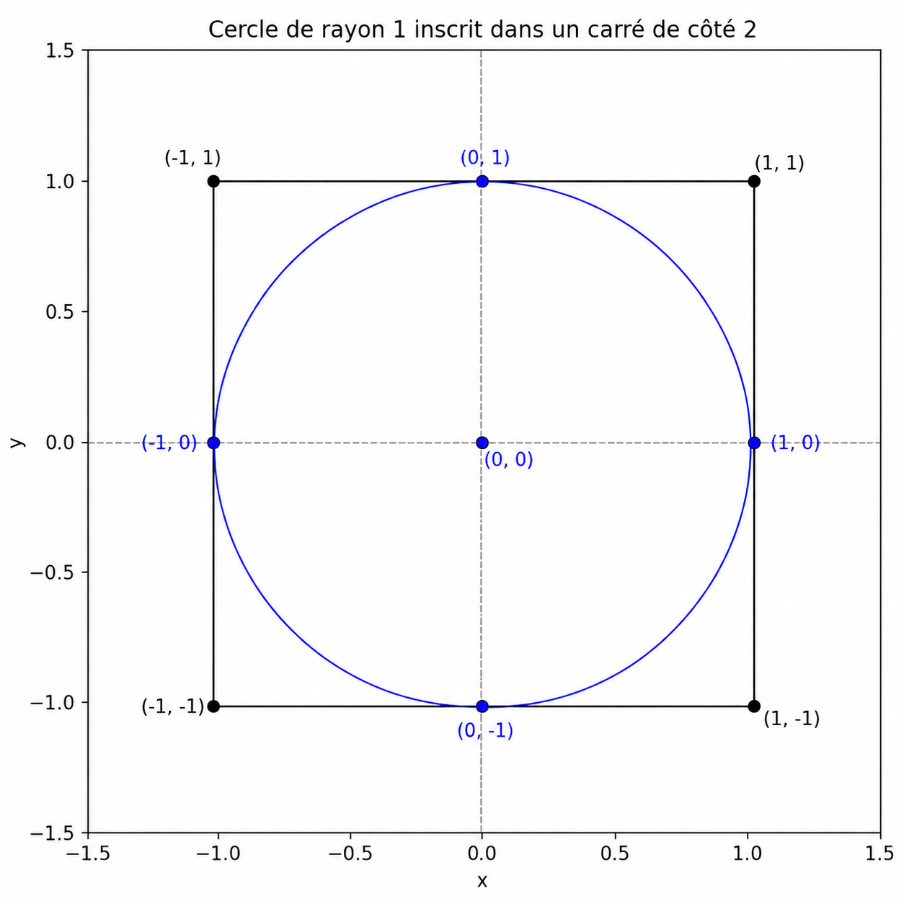
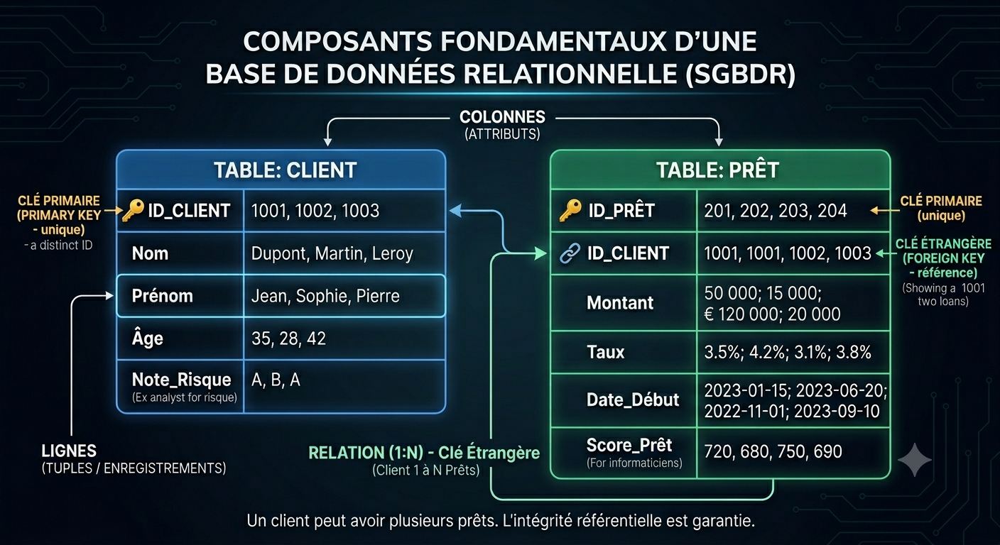

## Brève introduction à {height="1.2em" style="vertical-align: middle;"} et {height="1.2em" style="vertical-align: middle;"}

- Le langage R [@ihaka996 ] est une implémentation du langage **S**, développé par John Chambers. Ce langage a été primé par l'ACM avec cette ctation: 

```{r}
#| label: ACM
#| echo: false
#| include: true
#| 
fortunes::fortune("ACM")|>print()
```


- Le langage Python quant-à lui est apparu cinq ans plutôt en 1991, développé par **Guido van Rossum** aux Pays-Bas.Il est aujoud'hui le logiciel le plus utilisé pour l'IA. 

- Ce deux logiciels, se distinguent par leur flexibilité et leur interactivité. En effet, les logiciels comme SAS et SPSS ont un modèle d'analyse différée. Avec ce modèle, soumet une tâche en fournissant des données et les instructions, le logiciel effectue les analyse et imprime les informations susceptibles d'intéresser l'utilisateur qui scrute ces resultats pour extraire ce qui l'interèsse, et est limité aux processus proposés par le logiciel. 

- De l'autre côté, des langages performants comme C++ ou Java ne sont pas interactifs, car doivent être compilés, ce qui n'en fait pas outils de premier choix pour l'analyse des données.  

- Enfin, ces logiciels sont open-source, et donc sans un impact budgétaire considérable. 

## Installation des outils 

L'installation de R et Python se fait en général à partir des programme d'installation fournit par les sites oficiels des deux langages (www.r-project.org et www.python.org). Pour une utilisation lus efficace, il existe des outils plus performants notamment pour gestion des projets complexes (Rstudio, PyCharm, Positron, VS Code). Ces utils permettent de faire simulatenement les deux. Pour cette formation nous allons utiliser [Positron](https://positron.posit.co)  

**La fin du copier-coller ?** Une autre force ces outils c'est de permettre la _recherche reproductible_. Traditionnellement, pour rediger un rapport d'analyse, on utilise un logicel de traitement de texte, on realise les calculs et les graphiquesailleurs et souventpar copier-coller,les resultats sont intégrés au rapport. Avec R et Python, il est assez aisé de générer des rapports dynamiques. C'est à ce stade qu'intervient [**Quarto**](https://quarto.org)  

Les deux langages sont extnsibles avec une multitude de modules. Toutefois, les approches travail sont différentes. Avec R, vous chargez les modules donc vous avez besoin une fois qu'ils sont installés. C'est aussi le cas avec Python, mais avec option supplémentaires, **les environnements virtuels**. Un environnement est un espace de travail isolé qui contient sa propre installation de bibliothèque pour un projet donnée. Ils peuvent être crées avec un outil nommé **conda** ou l'outil par defaut **venv**. 

Sous windows le code ci-après permet de créer et d'actver un environnement virtuel ;


```bash
#| eval: false

python -m venv nom_environnement
nom_environnement\Scripts\activate
```


L'enviromment est alors créé dans le dossier où la commande création est appelée,et la seconde commande l'active. 

## Premiers pas avec R et Python 

<div><p style="font-size: 2em; color: blue;">Quelques commandes</p>
::::{.columns}

:::{.column width="50%"}
### {height="0.8em" style="vertical-align: middle;"}

```{r}
#| echo: true
#| label: Calc1

2+3 # addition de deux nombres 
sqrt(3/4)/(1/3-2/pi^2) #  racine carré et pi
x<-c(12.1,9.6,13,19,20.5,14.3,8,9.4,6.2)
m<-mean(x); v<-var(x)/length(x)
m/sqrt(v)
```

:::

:::{.column width="50%"}
### {height="1.2em" style="vertical-align: middle;"}

```{python}
#| echo: true
#| label: Calc1P
import math as mat
print(2+3)  
mat.sqrt(3/4)/(1/3-2/pow(mat.pi,2)) 

import numpy as np
x = np.array([12.1, 9.6, 13, 19, 20.5, 14.3, 8, 9.4, 6.2])
m = np.mean(x)
v = np.var(x, ddof=1) / len(x)  # ddof=1 pour reproduire var() de R
resultat = m / np.sqrt(v)
print(resultat)

```

:::

::::
</div>

On s'aperçoit de l'utilisation dans Python de la commande **import** pour accéder à certains fonctions. En fait, Python est langage universel pas destiné intialement aux statistiques, contrairement à R qui a un noyau de base avec l'essentiel des fonctions statistiques de base. En général les entreprises modélisent avec R, MATLAB, SAS, STATA, SPSS et développent les outils de mise en production avec C/C++, Java... Python règle le problème du double outillage permettant en même temps la modélisation et la mise en production.

Un autre élément important est l'opérateur **pipeline**. Cet operateur sert à traiter la composition des fonctions. Si on veut calculer 
$g \circ f \circ h \circ t(x)=g(f(h(t(x))))$, on court le risque d'ajouter ou omettre des parenthèses, et si les fonctions de la composition sont complexes, plusieurs instructions peuvent-être nécessaires, $$ v_1\leftarrow t(x), v_2\leftarrow h(v_1), v_3\leftarrow f(v_2), v_4\leftarrow f(v_3)$$ 

Dans R, avec l'opérateur pipeline (**|>** package **base** ou **%>%** du package **magrittr**), permet le calcul en une seule instruction $$v_4 \leftarrow x |> t()|>h()|>f()|>g()$$ Avec Python, dispose d'une fonction **.pipe()** que verrons.

<div><p style="font-size: 2em; color: blue;">Variables et stockage des données</p>

:::{.columns}

:::{.column width="50%"}
###  {height="0.8em" style="vertical-align: middle;"}

```{r}
#| echo: true
#| label: Calc3

x<-19                   # une valeur numérique
ville<-"Kinshasa"       # Du texte
nbCplx<-2+3i            # Un nombre complexe

xvec<-c(1,3,8,9)        # Un vecteur de taille 4
xsec<-seq(from=1,to=20,by=0.5) #suite arithmétique
wvec<-1+xsec/2          # wvec est aussi un vecteur
yvec<-5+3*xsec+wvec*rnorm(xsec) # ajout d'un bruit

(A<-matrix(c(1,2,3,4),nr=2)) # Une matrice

df<-data.frame(x=xsec,y=yvec,w=wvec) # Le data.frame
head(df)

liste<-list("RDC", TRUE, 100)  # une liste

rm(xsec,yvec,wvec) #Suppression de variable

```

:::

:::{.column width="50%"}
### {height="1.2em" style="vertical-align: middle;"}

```{python}
#| echo: true
#| label: Calc3P

import pandas as pd

x = 19              # Une valeur numérique
ville = "Kinshasa"  # Du texte
nbCplx = 2 + 3j     # Un nombre complexe
xvec = np.array([1, 3, 8, 9]) # Un vecteur de taille 4
xsec = np.arange(1, 20.5, 0.5) # Suite arithmétique de 1 à 20 par pas de 0.5
wvec = 1 + xsec / 2 # wvec est aussi un vecteur
yvec = 5 + 3 * xsec + wvec * np.random.normal(size=len(xsec))# Ajout d'un bruit 
A = np.array([[1, 3],[2, 4]]) # Une matrice 2x2
print(A)

df = pd.DataFrame({"x": xsec,"y": yvec,"w": wvec}) # Le DataFrame
print(df.head())

liste=["RDC", True, 100]  # Une liste

# Suppression des variables
del xsec
del yvec
del wvec

```

:::

::::

</div>

Comme on peut le voir, les syntaxes sont assez proches. Le concept de **data frame** est commun aux deux langages. C'est le tableau de données statistiques. Avec R,le package **dplyr** est fondamental pour la manipulation des data frame, comme l'est **panda** avec Python. 

Dans les deux langages les fonctions sont stockées comme objets de type **closure** et manipulables comme des objets classiques. Une fonction peut ainsi être passée en paramètre à une autre fonction. 

<div><p style="font-size: 2em; color: blue;">Les fonctions</p>
:::{.columns}

:::{.column width="50%"}
### {height="0.8em" style="vertical-align: middle;"}

```{r}
#| echo: true
#| label: Calc2

std.dev<-function(x) sqrt(var(x))
t.stat<-function(x,mu=0){
    n<-length(x)
    t<-sqrt(n)*(mean(x)-mu)/std.dev(x)
    rval<-c("T-Stat"=t,"P-value"=2*(1-pt(abs(t),n-1)))
    return(rval)
}
set.seed(123)
z<-rnorm(300,1,2)
t.stat(z);t.stat(z,1)


```

:::

:::{.column width="50%"}
### {height="1.2em" style="vertical-align: middle;"}

```{python}
#| echo: true
#| label: Calc2P

from scipy.stats import t

def std_dev(x):
    return np.sqrt(np.var(x, ddof=1))  # même définition que R

def t_stat(x, mu=0):
    n = len(x)
    t_value = np.sqrt(n) * (np.mean(x) - mu) / std_dev(x)
    p_value = 2 * (1 - t.cdf(abs(t_value), df=n-1))
    return {"T-Stat": float(t_value),"P-value": float(p_value)}

# Génération d'un échantillon N(1, 2²)
np.random.seed(123)
z = np.random.normal(loc=1, scale=2, size=300)

print(t_stat(z))
print(t_stat(z, 1))

```

:::

::::

</div>

Les fonctions sont fondamentales avec ces deux langages car permettent une très grande flexibilité. Avec R, Elles sont définies avec le mot clé **function** suivie de la liste des arguments et du corps de la fonction entre deux accolades. Avec Python, la fonction est définie avec **def**.

Un autre aspect important est le calcul itératif. Nous allons illustrer avec le calcul d'une valeur approximative de $\pi$ par **Monte Carlo**. 

<div style="display: flex; align-items: center;">

::: {.r-fit-text}

```{r}
#| echo: false
#| label: circle
#| fig-align: center



```

:::

</div>

Il est établit que $$\frac{\mbox{Aire}_{\mbox{cercle}}}{\mbox{Aire}_{\mbox{carré}}}=\frac{\pi}{4} $$

Pour estimer $\pi$ on simule $N$ points du carré, et fait le rapport en le nombre de points tirés, et le nombre dans le cercle.  

<div><p style="font-size: 2em; color: blue;">Calcul itératif et conditions </p>

:::{.columns}

:::{.column width="50%"}
### {height="0.8em" style="vertical-align: middle;"}

```{r}
#| echo: true
#| label: Calc4
#| cache: true


GetPI<-function(N,R=1){

    npi<-0
    for(i in 1:N){
        x<-runif(1,-R,R)
        y<-runif(1,-R,R)
        if(x^2+y^2<=R^2){
            npi<-npi+1
        }
    }
    return(4*npi/N)
}

n<-c(10,100,1000,10000,100000,1000000)
est<-rep(0,6)
for(i in seq_along(n)) est[i]<-GetPI(n[i])

df<-data.frame(n,est)
head(df)

```

:::

:::{.column width="50%"}
### {height="1.2em" style="vertical-align: middle;"}

```{python}
#| echo: true
#| label: Calc4P
#| cache: true

def get_pi(N, R=1):
    npi = 0
    for i in range(N):
        x = np.random.uniform(-R, R)
        y = np.random.uniform(-R, R)
        if x**2 + y**2 <= R**2:
            npi += 1
    return 4 * npi / N

n = [10, 100, 1000, 10000, 100000, 1000000]
est = np.zeros(len(n))

for i in range(len(n)):
    est[i] = get_pi(n[i])
df = pd.DataFrame({"n": n,"est": est})
print(df)

```

:::

::::

</div>


## La recherche reproductible avec {height="1.2em" style="vertical-align: middle;"} 

### Premier document .qmd

Un document comprend deux parties: l'en-tête **YAML(Yet Another Markup Language)** et le contenu rédactionnel qui contient le texte en **Markdown** et les blocs de code. Voici un exemple d'en-tête.

````yaml
---
title: "Capital à l'entrée des banques de la RDC"
author: "Jonas K"
date: today
date-format: "DD MMMMYYYY"
lang: fr 

format:
  pdf:
    toc: true
    number-sections: true
    colorlinks: true
---

````

Avant de produire des pdf, un générateur de PDF doit-être installé (MikTeX ou TeXLive) mais Quarto peut utiliser un générateur léger **TinyTeX**. Après avoir installé quarto, l'installation de TinyTeX se fait avec la commande: 


```bash
#| eval: false

quarto install tinytex
```


Le document va être ensuite structuré en sections, sous-sections, des références bibliographiques, du code pour les calculs, graphiques.  

````markdown

## Introduction {-}

La solidité d'une banque repose sur la qualité et le niveau de ses fonds propres. Le superviseur doit s'assurer qu'aussi bien au moment de la création que de son existance, elle dispose de fonds propres suffisants. 

Le Comité de Bâle a fixé les exigences en fonds propres des banques tout au long de leur existence. A minima, les fonds propres des banques doivent toujours couvrir 8% des ses risques pondérés. Cependant, rien n'est dit sur le capital de départ d'une banque. Comment alors fixé le capital de départ d'une banque ?

L'objectif de cet article est de proposer une approche de fixation du capital d'entrée d'une banque. La première partie présente le cadre analytique, la seconde les principaux résultats. 

## Cadre analytique

Plusieurs facteurs peuvent justifier l'augmentation du capital des banques. Notamment, le développement économique avec des besoins croissants de financement et l'émergence de nouveaux. Si nous désignons par $Y$, le niveau d'activité ou de production des banques, nous pouvons écrire la fonction de demande de capital comme:
$$K^d = F(r,Y,L)$$ $K^d $ est la demande de capital, $r$ le taux de rémunération du capital, $L$ le travail. Dans le secteur bancaire, la technologie peut être plus importante que la main d'oeuvre. La fonction de demande peut s'écrire : 

$$K^d = F(r,Y,A)$$ $A$ est la technologie. La figure ci-après montre le lien entre le total de bilan et les fonds propres de la banque.

```{{r}}

    read_xlsx('../Regdata.xlsx')|>
    ggplot(aes(x=`total bilan`,y=`fonds propres`,colour=categorie))+geom_point()+theme(legend.title=element_blank(),legend.position="bottom")

```


## Principaux resultats

## Conclusion et recommandations {-}

````

Pour compiler le document, deux options sont disponibles, utiliser Quarto en ligne de commande 

````bash
quarto render fichier.qmd
````
ou utiliser le package quarto de R.

````r
quarto_render("fichier.qmd")
````

## Introduction à SQL 

### Le concept de base de données 

@codd1970 a introduit le concept de bases de données relationnelles . Il a fournit un modèle permettant de structurer et de gérer efficacement de grandes quantités de données en utilisant des tables liées par des relations. Son approche a révolutionné le stockage et l’extraction des informations, facilitant l’analyse de données à grande échelle et posant les bases des systèmes de gestion de bases de données modernes (SGBD).

Une base de données est un ensemble de données organisées en **tables (ou relations)** liées entre elles par des identifiants communs. L'utilisateur ne souci pas de la manière dont sont stockées les informations, c'est le SGBR qui s'en charge.

:::{.notes}
Avec Excel, toute l'information est stockèe dans un seul fichier. 
:::

Les concepts suivant sont fondamentaux :

- **Table (ou relation)** : reprèsente une entité avec ses informations (banque, prêt, transfert);
- **Ligne (Tuple, enregistrement)** : occurence d'une entité
- **Colonne (Attribut)** : Une caractéristique spécifique de l'entité (ex: Nom, Date_de_naissance, Montant_du_credit).
- **Clé Primaire (Primary Key)** : L'identifiant unique d'une ligne dans une table (ex: Id_Client). Elle garantit qu'aucune ligne ne peut être confondue avec une autre.
- **Clé Étrangère (Foreign Key)** : C'est une colonne qui fait référence à la clé primaire d'une autre table, permettant de créer une relation entre les deux.

:::{.r-fit-text}



:::

### Le langage SQL

À la suite du travail de Codd, @sql1974 sont chargés de créer un langage capable d'interroger ces bases de données. Ils proposent un langage baptisé **SEQUEL (Structured English Query Language)**, car il a été conçu pour être aussi lisible qu'une phrase en anglais. Le changement de nom intervient pour des raisons de marque déposée (SEQUEL était déjà utilisé par une autre entreprise), le nom a été raccourci en SQL.

Ce langage permet d'interagir avec une base de données realtionnelle. Il est très concis avec juste quatre commande de base. Il est structuré en plusieurs volets, un langage de manipulation des données **LMD**, langage de définition des données **LDD**, le contrôle des accès **DCL**(Data Control language). 

```{r}
#| label: tabsql
#| echo: false
       
    library(kableExtra)

    dplyr::tibble(
        colonne =c("SELECT","INSERT","UPDATE","DELETE","CREATE","DROP","GRANT","REVOKE"),
        role=c("Lecture des données","Ajout des données","Mise à jour des données","Suppréssion des données","Création d'objets (BDD, Table, Utilisateur)","Suppression d'objets","Attribution des droits","Révocation des droits")
    )|>kable(format= "html",col.names=c("Commande","Fonction"))|>pack_rows("LMD",1,4)|>pack_rows("LDD",5,6)|>pack_rows("DCL",7,8)

```

Le langage SQL est normé (**ISO/IEC 9075**). En pratique, les éditeurs de logiciel de base de données (SGBDR) ajoutent  leurs propres fonctionnalités propriétaires, appelées **dialectes** (comme le PL/SQL chez Oracle ou le Transact-SQL chez Microsoft). Il existe une multitude de SGBDR. Les principaux sont : PostgreSQL, Oracle, MySQL, MS SQL Sever. Pour des utilisateurs à faible echelle SQLite, Microsoft Access. Il existe aussi des solutions cloud comme **BigQuery** de Google.

La bonne nouvelle est que SQL peut-être utiliser entièrement depuis R et Python pour la plupart des SGBDR. Dans R, il existe des packages pour la plupart des SGBDR : **ROracle, RPostgres, RMySQL, RODBC, RSQLite** avec Python les modules **psycopg2, mysql-connector-python, sqlite3**. Nous allons illustrer les concepts SQL avec SQLite, qui est intégré à R et Python. Nous traiterons du LDD et du LMD.


:::{.columns}

:::{.column width="50%"}
### {height="0.8em" style="vertical-align: middle;"}

```{r}
#| echo: true
#| label: DBRLDD

library(RSQLite) #Chargement du package
library(DBI)     #Interface standard de connection

con<-dbConnect(SQLite(),"../dbBCC.db",extended_type=TRUE)  # Objet de connexion au SGBDR

"create table if not exists banque (
    id_banque     integer not null,
    id_pays       integer not null,
    categorie     integer not null,
    pays          text not null,
    primary key (id_banque, id_pays)
)"|>dbExecute(con,statement=_)

"create table if not exists capital (
    id_banque     integer not null,
    id_pays       integer not null,
    annee         integer not null,
    mois          integer not null,
    fpc           float not null,
    bilan         float not null,
    fpr           float not null,
    rwa           float not null,
    primary key (id_banque, id_pays, annee, mois)
    foreign key (id_banque, id_pays) references banque (id_banque, id_pays)
        on update cascade
        on delete cascade
)"|>dbExecute(con,statement=_)

"create table if not exists liquidity (
    id_banque     integer not null,
    id_pays       integer not null,
    annee         integer not null,
    mois          integer not null,
    pnl1          float not null,
    pnl2          float not null,
    pnl3          float not null,
    pnl4          float not null,
    primary key (id_banque, id_pays, annee, mois)
    foreign key (id_banque, id_pays) references banque (id_banque, id_pays)
        on update cascade
        on delete cascade
)"|>dbExecute(con,statement=_)

"create table if not exists loansdeposits (
    id_banque     integer not null,
    id_pays       integer not null,
    annee         integer not null,
    mois          integer not null,
    depots        float not null,
    credits       float not null,
    provisions    float not null,
    npl           float not null,
    primary key (id_banque, id_pays, annee, mois)
    foreign key (id_banque, id_pays) references banque (id_banque, id_pays)
        on update cascade
        on delete cascade
)"|>dbExecute(con,statement=_)


```

:::

:::{.column width="50%"}
### {height="1.2em" style="vertical-align: middle;"}

```{python}
#| echo: true
#| label: DBPythonLDD

import sqlite3
con = sqlite3.connect("../dbBCC.db") # Connexion à la base de données

reqSQL= """
CREATE TABLE IF NOT EXISTS banque (
    id_banque     INTEGER NOT NULL,
    id_pays       INTEGER NOT NULL,
    categorie     INTEGER NOT NULL,
    pays          TEXT NOT NULL,
    PRIMARY KEY (id_banque,id_pays)
)
"""
con.execute(reqSQL) # Exécution de la requête

```

:::

::::

Chargeons la base ave un fichier Excel

```{r}
#| label: loadDB

# Chargement avec un fichier Excel
n<-"select count(*) from banque"|>
    dbGetQuery(con,statement=_)|>unlist() # Nb de tuples dans la table

if(n==0){
    library(readxl)
    bks<-read_xlsx("../banque.xlsx")
    nobs<-dim(bks)[1]

    for (i in 1:nobs){
        req<-paste0(
            "INSERT INTO banque (id_banque, id_pays, categorie, pays)
            VALUES (",bks[i,1],",",bks[i,2],",",bks[i,3],",'",bks[i,4],"')"
        )
        
        ok<-dbExecute(con,req)
        if(ok==0) {
            paste0("Requête :",req,"\n","exécutée avec succès...\n")|>cat()
        }
    }

} else {
    cat("BDD déjà chargée...\n")
}

```

La création des tables peut être déléguée à R ou Python avec les fonctions **dbWriteTable** et **DataFrame.to_sql**. 


:::{.columns}

:::{.column width="50%"}
### {height="0.8em" style="vertical-align: middle;"}

```{r}
#| echo: true
#| label: WriteTableR


if (!dbExistsTable(con,"capital")){
    capital<-read_xlsx("../capital.xlsx")
    dbWriteTable(con,"capital",capital,overwrite=T)
}

```

:::

:::{.column width="50%"}
### {height="1.2em" style="vertical-align: middle;"}

```{python}
#| echo: true
#| label: WriteTablePython

from sqlalchemy import create_engine
from sqlalchemy import inspect

engine = create_engine("sqlite:///../dbBCC.db")
insp = inspect(engine)

if "loansdeposits" not in insp.get_table_names():
    loansdeposits = pd.read_excel("../loansdeposits.xlsx")
    loansdeposits.to_sql("loansdeposits",engine,if_exists="replace",index=False)

if "liquidity" not in insp.get_table_names():
    liquidity = pd.read_excel("../liquidity.xlsx")
    liquidity.to_sql("liquidity",engine,if_exists="replace",index=False)

```

:::

::::

```{r}
#| label: ALTER
#| echo: FALSE
#| eval: FALSE

"ALTER TABLE capital ADD PRIMARY KEY (banque, id_pays, annee, mois);"|>
    dbExecute(con, statement=_)

"ALTER TABLE liquidity ADD PRIMARY KEY (banque, id_pays, annee, mois);"|>
    dbExecute(con, statement=_)

"ALTER TABLE loansdeposits ADD PRIMARY KEY (banque, id_pays, annee, mois)"|>
    dbExecute(con, statement=_)
```

Nous allons maintenant aborder la commande **SELECT** sa structure est de la forme 
````sql
SELECT [ ALL | DISTINCT ]
       <liste_des_expressions>
FROM   <table_reference>
WHERE  <condition>
GROUP BY <colonnes>
HAVING <condition>
ORDER BY <expression>;
````

Cette commande lire les informations d'une ou plusieurs tables. Nous allons illustrer par des exemples. Les commandes peuvent lancées en utilisant **Positron** ou depuis R ou Python. 


:::{.columns}

:::{.column width="50%"}
### {height="0.8em" style="vertical-align: middle;"}

```{r}
#| echo: true
#| label: SELECTR1

# Lire la table capital
"select * from capital"|>dbGetQuery(con, statement=_)|>head()

# Lire quelques variables et création de nouvelles variables
"select id_banque, id_pays, fpc,fpr, rwa, log(bilan) as taille from capital"|>
    dbGetQuery(con,statement=_)|>head()

# Selection avec filtre des informations 
"select * 
from capital
where id_pays=1"|>
    dbGetQuery(con,statement=_)|>head()

# Afficher les modalités de variable pays  clause: distinct 
"select distinct id_pays  from capital"|>dbGetQuery(con, statement=_)

# Compter le nombre de tuples de la table
"select count(*) as N from capital"|>dbGetQuery(con, statement=_)

```

:::

:::{.column width="50%"}
### {height="1.2em" style="vertical-align: middle;"}

```{python}
#| echo: true
#| label: SELECTPython1

# Lire la table capital
capital= pd.read_sql(
    "select * from capital",
    con
)

print(capital.head())

# Lire quelques variables et création de nouvelles variables
capital= pd.read_sql(
    "select id_banque, id_pays, fpc, fpr, rwa, log(bilan) as taille from capital",
    con
)

print(capital.head())

# Selection avec filtre des informations 
capital= pd.read_sql(
    "select * from capital where id_pays=4",
    con
)

print(capital.head())

# Afficher les modalités de variable pays  clause: distinct 
capital= pd.read_sql(
    "select distinct id_pays  from capital",
    con
)

print(capital.head())

# Compter le nombre de tuples de la table
capital= pd.read_sql(
    "select count(*) as N from capital",
    con
)

print(capital.head())

```

:::

::::

La commande **SELECT** ne se limite pas à afficher les données, elle permet d'obtenir des résumés (Moyenne,Max, Min, Somme...) sur l'ensemble de la table ou par groupe. Nous allons voir ce volet analytique. 


:::{.columns}

:::{.column width="50%"}
### {height="0.8em" style="vertical-align: middle;"}

```{r}
#| echo: true
#| label: SELECTR2

# Afficher les statistiques des variables
"select AVG(fpc) as Moyenne, SUM(fpc) as Total from capital"|>dbGetQuery(con, statement=_)|>head()

# statistiques par pays
"select id_pays, AVG(fpc) as Moyenne, SUM(fpc) as Total
 from capital
 group by id_pays"|> dbGetQuery(con,statement=_)|>head()

# Filtre sur les statistiques 
"select id_pays, AVG(fpc) as Moyenne, SUM(fpc) as Total
 from capital
 group by id_pays
 having fpc>50000"|>
    dbGetQuery(con,statement=_)|>head()

```

:::

:::{.column width="50%"}
### {height="1.2em" style="vertical-align: middle;"}

```{python}
#| echo: true
#| label: SELECTPython2

# statistiques du capital par pays et années
capital= pd.read_sql(
    "select id_pays, annee, AVG(fpc) as Moyenne, SUM(fpc) as Total " 
    "from capital group by id_pays, annee",
    con
)

print(capital.head())

```

:::

::::


## Références du chapitre

::: {#refs}
:::
