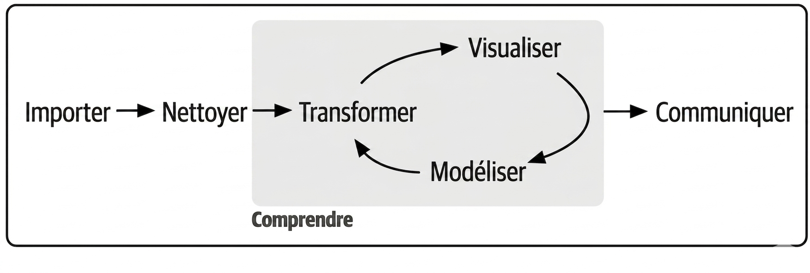
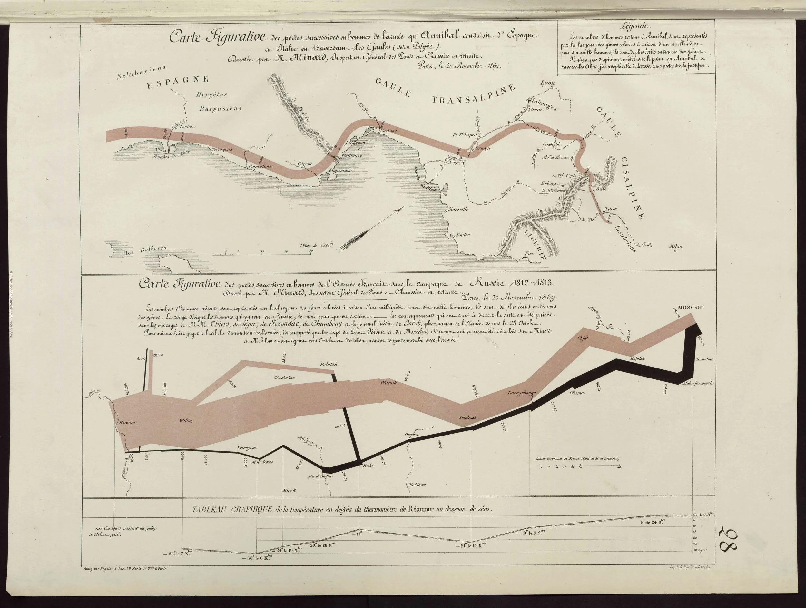
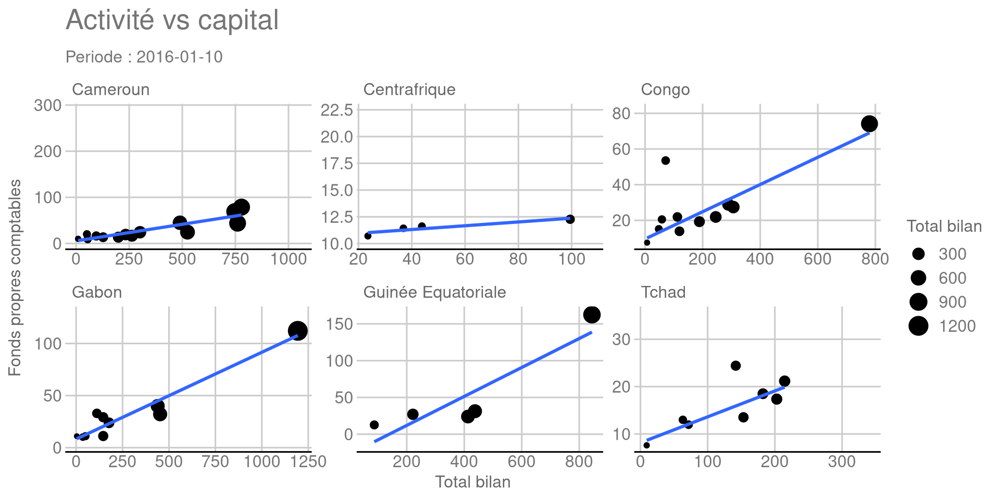

## Programme de la journée

L'objectif du jour est d'illustrer succinctement les outils de la **Data Science**. Le schéma ci-après inspiré de [@r4ds] nous servira de fil conducteur. En outre, vous travaillerez directement dans le fichier *index.qmd* du répertoire **training** dans le **repo git** qui vous avez téléchargé.   

:::{.r-fit-text}

:::

### Importation des données

À des fins d'analyse, il existe une multiplicité de source et de forme de données. Elles doivent être lues et importées à des fins d'analyse. Nous verrons les principaux formats et source de données.

### Nettoyage des données

Les données importées ne sont pas toujours immédiatement exploitables. Les problèmes de qualité de données pour souvent sur les valeurs manquantes, les doublons, les erreurs de saisie, les formats incohérents et les valeurs aberrantes.

### Analyse ou de compréhension 

Elle comprend la transformation des données, la visualisation et la modélisation. Cette phase est habituellement réalisée de manière itérative. On ne tombe pas toujours sur le _meilleur modèle_ au premier coup. 

### Communication 

Nous aborderons deux approches de communications des rapports rédigés et des dashbarods intercatifs. 


## Importation et nettoyage des données

### Importation 

Avec R, il existe de nombreux outils de lectures de données. Le tableau ci-après fait une synthèse. 


```{r}
#| label: rImportPkgs
#| echo: false
    library(tidyverse)   
    library(kableExtra)

    dplyr::tibble(
        colonne =c("base, readr", "readxl, openxlsx2","haven, foreign", "DBI+packages drivers","jsonlite","xml2","fredr, wbstats"),
        role=c("csv, txt","Excel", "SAS/SPSS/Stata","Base de données","JSON","XML","FED, Banque Mondiale")
    )|>kable(format= "html",col.names=c("Packages","Formats ou sources lues"))

```

En Python, la situation est plus centralisée autour de Pandas, même si Pandas s'appuie souvent sur d'autres bibliothèques en arrière-plan.

Nous avons vu hier, la lecture depuis une base de données (SQlite) et des fichiers Excel. C'est le cas les plus fréquents, mais on rencontre aussi des fichiers **.csv** ou **.txt**. Dans le répertoire data de votre repo, vous avez deux fichiers nommés **teams.csv** et **squads_and_players.csv** que nous allons importer dans R et Python. Ces fichiers comportent les informations sur les pays qui ont participé au mondial 2026. 

::::{.columns}

:::{.column width="50%"}
### {height="0.8em" style="vertical-align: middle;"}

```{r}
#| echo: true
#| label: ImportCSVR

library(readr)
teams<-read_csv("../teams.csv")
squads<-read_csv("../squads_and_players.csv")

```

:::

:::{.column width="50%"}
### {height="0.86em" style="vertical-align: middle;"}

```{python}
#| echo: true
#| label: ImportCSVPython

import pandas as pd
teams = pd.read_csv("../teams.csv")
squads= pd.read_csv("../squads_and_players.csv")

```

:::

::::

```{r}
#| echo: false
#| label: displayTeams

head(teams)
```

Un cas de figure assez complexe est la lecture d'un tableau dans un fichier pdf. 

<iframe
  src=../data/Stat_Mensuelle_ArrDepDGA-Sept.PDF
  width="100%"
  height="300px">
</iframe>

Nous allons essayer de lire ce tableau avec les outils de R et Python, et nettoyer les données pour les rendre exploitables. 

::::{.columns}

:::{.column width="50%"}
### {height="0.8em" style="vertical-align: middle;"}

```{r}
#| echo: true
#| label: ImportPdfDataR
library(pdftools)
library(stringr)
library(dplyr)

# Récupération de la page 1
p1<-pdf_text("../data/Stat_Mensuelle_ArrDepDGA-Sept.PDF")|>str_split(pattern="\n")
p1<-p1[[1]]

l4 <-str_split(p1[4],"\\s{2,}")
l22<-str_split(p1[22],"\\s{2,}")

vname  <-l4[[1]][-1:-2]
valeur <-l22[[1]][-1]|>str_replace(" ","")|>as.numeric()
grp    <-c(rep("Arrivée",3),rep("Depart",3),rep("Total",3),"Ensemble")

df<-tibble::tibble(grp,vname,valeur)
df

```
:::

:::{.column width="50%"}
### {height="0.86em" style="vertical-align: middle;"}

```{python}
#| echo: true
#| label: ImportPdfDataPython

import camelot

tables=camelot.read_pdf("../data/Stat_Mensuelle_ArrDepDGA-Sept.PDF",
    flavor="stream",
    strip_text='\n')
df=tables[0].df
df=df.iloc[[4,23],1:11].T
df.columns=["vname","valeur"]

colonnes_cibles = ["valeur"]

for col in colonnes_cibles:
    df[col] = df[col].astype(str).str.replace(" ", "")
    df[col] = pd.to_numeric(df[col], errors="coerce")


print(df)

```

:::

::::

Si la lecture doit se faire sur plusieurs fichiers, une fonction peut intervenir


::::{.columns}

:::{.column width="80%"}
### {height="0.8em" style="vertical-align: middle;"}

```{r}
#| echo: true
#| label: ImputeDataR
#| eval: true

# Creation de la fonction

ReadMyData<-function(filename){

  textData<-pdf_text(paste0("../data/",filename))|>str_split(pattern="\n")
  p1<-textData[[1]]
  l4 <-str_split(p1[4],"\\s{2,}")
  l22<-str_split(p1[22],"\\s{2,}")

  vname  <-l4[[1]][-1:-2]
  valeur <-l22[[1]][-1]|>str_replace(" ","")|>as.numeric()
  grp    <-c(rep("Arrivée",3),rep("Depart",3),rep("Total",3),"Ensemble")

  df<-tibble::tibble(grp,vname,valeur)
  Mois<-str_extract(filename,pattern="(?<=[ -])[^.]+")
  df|>mutate(mois=Mois)
  
}

# On recupere le nom des pdfs
lf<-list.files("../data",pattern=".PDF")

# Initialisation d'un data frame vide

sortie<-data.frame()

for (i in seq_along(lf)) sortie<-sortie|>bind_rows(ReadMyData(lf[i]))

sortie

# formatage des mois pour de 1 à 12 : plusieurs options je prefere left_join

sortie <-sortie|>left_join(
  tibble(
    mois =str_extract(lf,pattern="(?<=[ -])[^.]+"),
    cmois=c(4,6,5,8,12,2,1,7,3,11,10,9)
  )
)|>arrange(cmois)

sortie

```
:::

:::{.column width="50%"}
### {height="0.86em" style="vertical-align: middle;"}

```{python}
#| echo: true
#| label: ImputePython


```

:::
::::

## Analyse exploratoire et visualisation

Dans cette partie, nous allons utiliser les données métiers enregistrées dans la base de données SQLite. Nous allons produire des résumés statistiques et visuels de données. 

### Visualisation des données

::: {.fragment}

> *« Un bon croquis vaut mieux qu'un long discours. »*
>
> — Napoléon Bonaparte

:::

::: {.fragment}

{width=100%}


:::

@wilkinson05 propose une vision révolutionnaire de la visualisation des
données : un graphique n'est pas un objet spécifique (histogramme, nuage de
points, boîte à moustaches), mais la combinaison systématique de composants
élémentaires tels que les données, les variables esthétiques (position,
couleur, taille, forme), les transformations statistiques, les systèmes
de coordonnées et les facettes. Cette **grammaire** permet de construire
pratiquement n'importe quel graphique complexe à partir d'un petit nombre
de règles générales, de la même manière qu'une langue permet de produire
une infinité de phrases à partir de règles grammaticales. Cette approche
a profondément influencé la visualisation moderne et constitue le fondement
théorique de bibliothèques comme **ggplot2** en R et, plus indirectement,
de nombreux outils de visualisation contemporains.

>**ggplot** est disponible aussi bien en R et Python.

::::{.columns}

:::{.column width="50%"}
### {height="0.8em" style="vertical-align: middle;"}

```{r}
#| echo: true
#| label: ggplot1
library(DBI)
library(RSQLite)

sqcon<-dbConnect(SQLite(),"../dbBCC.db")
dbListTables(sqcon)

capital<-dbReadTable(sqcon,"capital")
banque <-dbReadTable(sqcon,"banque")
# package de base ; Nuage de point

plot(x=capital$bilan,y=capital$fpc,main="Activité vs capital",
xlab="Total du bilan",ylab="fonds propres",pch=19,col='blue')

# Un camembert des parts du capital
## preparation des data

tab<-capital|>left_join(banque)|>group_by(pays)|>
summarise(capital=sum(fpc),bilan=sum(bilan))
tab

pie(tab$capital,labels=tab$pays)

## un diagramme a barre du capital et du total bilan
barplot(t(cbind(tab$capital,tab$bilan)),legend=c("Capital","Total bilan"),
       names.arg=tab$pays,beside=TRUE)
```

:::

:::{.column width="50%"}
### {height="0.86em" style="vertical-align: middle;"}

```{python}
#| echo: true
#| label: Python1Gr

from sqlalchemy import create_engine
from sqlalchemy import inspect

import matplotlib
matplotlib.use('Agg')
import matplotlib.pyplot as plt
 
engine = create_engine("sqlite:///../dbBCC.db")
insp   = inspect(engine)
print(insp.get_table_names())

capital = pd.read_sql_table("capital",engine)

plt.scatter(capital['bilan'],capital['fpc'],marker='o',color='blue',
  s=40
)

plt.title("Acivité vs capital")
plt.xlabel("Total bilan")
plt.ylabel("Fonds propres")
plt.grid(alpha=0.3)
plt.show()

# recuperation de tab avec Python via reticulate
tab=r.tab
print(tab)

plt.pie(tab['capital'],labels=tab['pays'])


```

:::
::::

Comme on peut le constater, chaque type de graphique dispose de sa commande
spécifique _plot, pie, barplot..._. @wickham2016 implémente une grammaire graphique
pour R. Il est lauréat du prix **COPSS[^1] (Comité des présidents de sociétés statistiques, Committee of Presidents of Statistical Societies)**    

[^1]: une distinction remise chaque année par le Comité des présidents des sociétés statistiques à une personne âgée de moins de 41 ans, en reconnaissance de ses contributions exceptionnelles à la profession de statistiques.
Le prix COPSS, avec le Prix international de statistiques, sont considérés
comme les deux plus hautes récompenses en statistiques (les _prix Nobel_
de la statistique). Il correspond entre autres par sa limitation d'âge à la
médaille Fields.

Avec ce package tous les graphiques sont construits avec les mêmes briques.

::::{.columns}

:::{.column width="50%"}
### {height="0.8em" style="vertical-align: middle;"}

```{r}
#| echo: true
#| label: ggplotR2
library(ggplot2)

capital|>ggplot(aes(x=bilan,y=fpc))+geom_point()

```

:::

:::{.column width="50%"}
### {height="0.86em" style="vertical-align: middle;"}

```{python}
#| echo: true
#| label: GgplotPython
#| out.height: "150%"

from plotnine import *

g1=ggplot(capital,aes(x="bilan",y="fpc"))+geom_point()
g1.show()

```

:::
::::

Sur cette partie de visualisation, nous allons travailler exclusivement
avec R, comme ggplot est disponible dans les deux environnements. Commençons
par analyser le lien entre l'activité (total bilan) et le capital.
Le graphique prend en compte l'année. 


::::{.columns}

:::{.column width="100%"}
### {height="0.8em" style="vertical-align: middle;"}

```{r}
#| echo: true
#| label: ggplotR3

library(lubridate)

capital|>left_join(banque)|>
  ggplot(aes(x=log(bilan),y=log(fpc),color=pays))+geom_point()+facet_wrap(~annee,scales="free")

```
:::
::::

Quel modèle derrière les données ? Le graphique ci-après montre qu'un
modèle linéaire peut bien s'ajuster à ces données. 


::::{.columns}

:::{.column width="100%"}
### {height="0.8em" style="vertical-align: middle;"}

```{r}
#| echo: true
#| label: ggplotR4

capital|>left_join(banque)|>
  ggplot(aes(x=log(bilan),y=log(fpc)))+geom_point()+
  geom_smooth(method=MASS::rlm,se=F)+
  facet_grid(annee~pays,scales="free")

```

:::

::::

**ggplot** permet d'appliquer des thèmes prédéfinis. Par exemple,
l'apparence d'Excel. Les thèmes sont fournis par le package **ggthemes**.    


::::{.columns}

:::{.column width="100%"}
### {height="0.8em" style="vertical-align: middle;"}

```{r}
#| echo: true
#| label: ggplotRThemes

library(ggthemes)

capital|>left_join(banque)|>
  ggplot(aes(x=log(bilan),y=log(fpc)))+geom_point()+
  geom_smooth(method=MASS::rlm,se=F)+
  facet_grid(annee~pays,scales="free")+theme_excel()

```
:::
::::

Le code précédent a montré comment reproduire et obtenir plusieurs graphiques pour les combinaisons de variables qualitatives. Mais on peut regrouper des graphiques de nature différentes ne portant pas sur les mêmes données avec le package **patchwork**.

::::{.columns}

:::{.column width="100%"}
### {height="0.8em" style="vertical-align: middle;"}

```{r}
#| echo: true
#| label: ggplotRMultiplots

library(patchwork)
library(tidyverse)
library(formattable)
library(ggrepel)

p1<-tab|>pivot_longer(cols=2:3)|>
    ggplot(aes(x=pays,y=value/1e6,fill=name))+geom_col(position='dodge')+
    coord_flip()+theme_gdocs()+xlab("")+ylab("")+
    theme(legend.title=element_blank(),legend.position="bottom",
    legend.direction="horizontal")

p2<-tab|>arrange(desc(pays))|>
       mutate(prop=percent(capital/sum(capital),0),
               centre=cumsum(capital)-capital/2)|>
ggplot(aes(x="",y=capital,fill=pays))+
    geom_bar(width=1,stat="identity",color='white')+
    coord_polar(theta="y",start=0)+
    geom_label_repel(aes(y=centre,label=prop),color="white",size=5,
                    show.legend=F,nudge_x=1)+
    theme_void()+
    theme(legend.title=element_blank())
    
p1+p2 

```
:::
::::

### Animation et cartographie

Nous avons au début construit un nuage de point des variables capital
et bilan, sans tenir compte du pays et l'année. On parle souvent de
modèle empilé **pooled model**. Avec les **facets** de ggplot, on a
essayé de prendre en compte les autres dimensions. Les animations fournies
par le package **gganimate** offrent une autre possibilité pour examiner
les données hiérarchiques.


::::{.columns}

:::{.column width="100%"}
### {height="0.8em" style="vertical-align: middle;"}

```{r}
#| echo: true
#| label: ggAnimate
#| eval: false

library(gganimate)

p<-capital|>mutate(date=make_date(annee,mois,10))|>
   left_join(banque)|>
   ggplot(aes(x=bilan/1000,y=fpc/1000))+
   geom_point(aes(size=bilan/1000))+
   geom_smooth(method=MASS::rlm,se=F)+
   facet_wrap(~pays,scales="free")+
   theme_gdocs()+
   labs(
    title="Activité vs capital",
    subtitle="Periode : {frame_time}",
    x="Total bilan",
    y="Fonds propres comptables",
    size="Total bilan"
   )

animation<-p+transition_time(date)+ease_aes('linear')

animate(
  animation,
  nframes=36,
  fps=1,
  renderer=gifski_renderer("anim.gif")
)

```

:::

::::



La cartographie consiste à afficher les données sur une carte géographique.
De nombreux packages R excellent dans ce domaine, jadis dominé par **ArcGIS**.
Une carte géographique peut être représentée par un ensemble de données numériques.
Deux packages **sf** et **leaflet** vont servir à illustrer.

::::{.columns}

:::{.column width="100%"}
### {height="0.8em" style="vertical-align: middle;"}

```{r}
#| echo: true
#| label: ggplotRSF

library(geodata)
library(sf)

if(!file.exists("../maps/gadm/gadm41_COD_1_pk.rds")){
rdc<-gadm("COD",level=1,path="../maps")|>st_as_sf()
}else{
  rdc<-readRDS("../maps/gadm/gadm41_COD_1_pk.rds")|>
  terra::unwrap()|>st_as_sf()
}

head(rdc)

ggplot(rdc)+geom_sf()

agences <- data.frame(
  NAME_1 = c(
    "Kinshasa", "Haut-Katanga", "Kongo-Central", "Nord-Kivu", "Lualaba", 
    "Sud-Kivu", "Ituri", "Tshopo", "Haut-Uele", "Kasaï-Oriental", 
    "Kasaï-Central", "Kwilu", "Équateur", "Maniema", "Tanganyika", 
    "Lomami", "Sud-Ubangi", "Kasaï", "Kwango", "Bas-Uele", 
    "Nord-Ubangi", "Mongala", "Sankuru", "Mai-Ndombe", "Haut-Lomami", "Tshuapa"
  ),
  agences = c(184, 70, 57, 32, 24, 18, 12, 10, 6, 6, 5, 4, 3, 3, 3, 2, 2, 1, 1, 1, 1, 0, 0, 0, 0, 0),
  Couverture = factor(c(
    "Concentration critique", "Couverture élevée", "Couverture élevée", "Couverture moyenne", "Couverture moyenne",
    "Couverture modérée", "Couverture faible", "Couverture faible", "Couverture faible", "Couverture faible",
    "Couverture faible", "Couverture critique", "Couverture critique", "Couverture critique", "Couverture critique",
    "Couverture critique", "Couverture critique", "Couverture critique", "Couverture critique", "Couverture critique",
    "Couverture critique", "Zone blanche", "Zone blanche", "Zone blanche", "Zone blanche", "Zone blanche"
  ), 
  # On ordonne les catégories pour que la légende soit logique du plus fort au plus faible
  levels = c("Concentration critique", "Couverture élevée", "Couverture moyenne", "Couverture modérée", "Couverture faible", "Couverture critique", "Zone blanche"))
)

rdc|>left_join(agences)|>
  ggplot()+geom_sf(aes(fill=agences),color="white",size=0.2)+
  geom_sf_label(aes(label = NAME_1), size = 2, alpha = 0.7)+
  theme_minimal()

```
:::
::::

Maintenant regardons l'interactivite avec **leaflet** 

::::{.columns}

:::{.column width="100%"}
### {height="0.8em" style="vertical-align: middle;"}

```{r}
#| echo: true
#| label: ggplotRLeaflet

library(leaflet)


if(!file.exists("../maps/gadm/gadm41_COD_1_pk.rds")){
rdc<-gadm("COD",level=1,path="../maps")|>st_as_sf()
}else{
  rdc<-readRDS("../maps/gadm/gadm41_COD_1_pk.rds")|>
  terra::unwrap()|>st_as_sf()
}

pal <- colorNumeric(
    palette = "Blues",
    domain = agences$agences
)

centres<-st_centroid(rdc|>left_join(agences))

rdc|>left_join(agences)|>mutate(long=st_coordinates(centres)[,1],
    lat=st_coordinates(centres)[,2])|>
   leaflet()|>
    addTiles()|>
    addMarkers(
        data=centres,
        popup=~paste(NAME_1,":",agences)
    )|>
    addCircles(
      lng=~long,lat=~lat,
      weight=1,
      radius=~sqrt(agences)*5000,
      color=~pal(agences),
      fillOpacity=0.9
    )|>
    addPolygons()|>
    addLegend(
        pal = pal,
        values = ~agences,
        title = "Agences de banque"
    )
   
```
:::
::::


::::{.columns}

:::{.column width="50%"}
### {height="0.8em" style="vertical-align: middle;"}

```{r}
#| echo: true
#| label: EmptyR

```

:::

:::{.column width="50%"}
### {height="0.86em" style="vertical-align: middle;"}

```{python}
#| echo: true
#| label: EmptyPython

```

:::
::::


## Références du chapitre

::: {#refs}
:::
